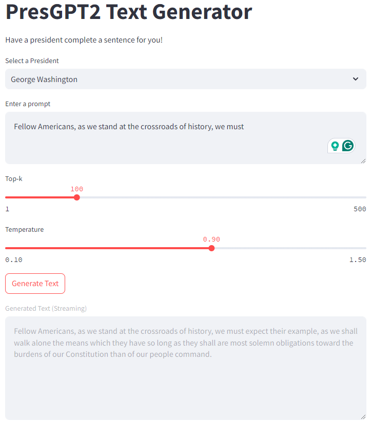

# PresGPT2

**PresGPT2** is a GPT model trained to complete phrases in the style of a given U.S. president.  

🌐 **Live Demo**: https://president-gpt2-dfbq9judmtpbztdw2o7snp.streamlit.app/
- *Note: The demo runs on a CPU instance, so response times may be slower.*

---

## Features
- Generates text in the style of some of the most popular U.S. presidents.
- Provides an interactive way to explore historical speech patterns.

---

## Examples

### Generated Text
  

---
